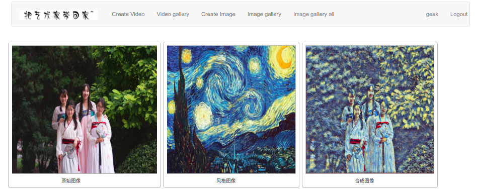
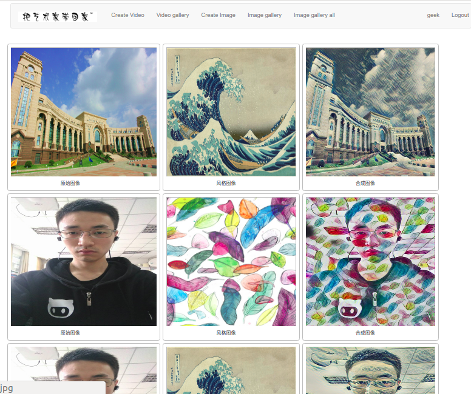

## 这是什么?
django+fast-neural-style-tensorflow+neural-style\_diy
## 需要环境
* tmux
* tmuxinator
* docker 并且把当前用户加到docker组中
## 需要文件
* style models --训练好的风格模型
* vgg\_16.ckpt --vgg16模型
* vgg19 --vgg19模型
	* `VGG_ILSVRC_19_layers.caffemodel`
	* `VGG_ILSVRC_19_layers_deploy.prototxt.lua`
	* `vgg_normalised.caffemodel`
* train2014  --coco数据集  如果不训练模型就不需要
* `list_img_all` --精选的`fast-neural-style-tensorflow`示例图片  非必要
* `intel:v4.tar` --镜像文件，如果没有可以从我们的dockerhub上获取

## 如何使用
#### 为需要的数据，模型做软连接
* `neural_web`
```
git clone --recurse-submodules git@github.com:lihao2333/neural_web.git
cd neural_web
ln -sf `pwd`/neural_web.yml ~/.tmuxinator/ 
ln -sf  /Dataset/style_transfer ./media/list_img_all
```

* `fast-neural-sytle-tensorflow`
```
cd fast-neural-style-tensorflow
ln -sf /Model/styles models
ln -sf /Dataset/train2014 .
cd..
```
* `neural-style_diy`
```
cd neural-style_diy
ln -sf /Model/vgg19/ models 
cd ..
```
#### 安装需要的docker镜像
* 一种方法从dockerhub上获取`docker pull lihao2333/intel:v4`
* 如果有镜像文件的话，执行`docker load<intl:v4.tar`

#### 运行
* 执行`mux start neural_web`,会自动打开一个tmux的session, 同时里面会自动运行docker
* 登录`<your ip address>:8000`既可

#### 最终效果
* 查看视频

* 创建图片

* 查看图片

* 查看精选图片

